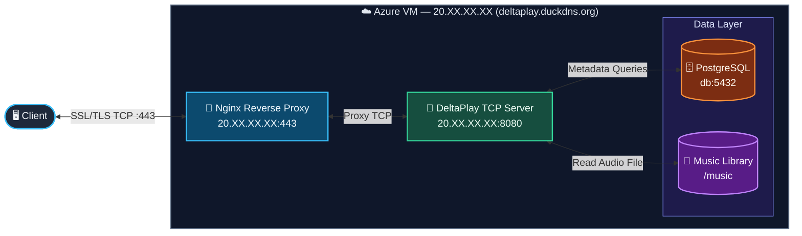

# SYSAD_TASK3

## Overview 
This repository is divided two sections into `task3a` and `task3b` 
1. `task3a` : Focuses on containerizing the deltaplay server application and deploying on Cloud
2. `task3b` : Built 5 CTF challenges and solved them

# Task 3A

## Overview 
> Containerized a Python-based music streaming server using Docker and orchestrated the complete application with Docker Compose, including the backend, PostgreSQL database, and nginx. Deployed an Nginx reverse proxy in front of the DeltaPlay server to securely forward client requests. Configured health checks, persistent Docker volumes, environment variables configuration, and isolated internal networking to improve reliability, maintainability, and deployment consistency in a production-like environment.

## Features

- **Database Health Monitoring**
  - Implemented Docker health checks for the PostgreSQL service, ensuring dependent services start only after the database is fully initialized.

- **Persistent Database Storage**
  - Configured Docker named volumes to persist PostgreSQL data across container restarts, recreations, and image updates, preventing data loss during deployments.

- **Environment-Based Configuration**
  - Managed application configuration using a `.env` file, securely injecting database credentials, secrets, and runtime configuration into containers without hardcoding sensitive information.

- **Bridge Network Isolation**
  - Configured a dedicated Docker bridge network to enable secure inter-container communication while isolating internal services from the host network.

- **Containerized Multi-Service Architecture**
  - Orchestrated backend and PostgreSQL services using Docker Compose with isolated networking, and inter-container communication.
    
- **Network Security**

  - Configured the VM firewall to allow only SSH (22) and HTTPS (443) traffic while blocking all other inbound ports, reducing the attack surface.

- **Domain Configuration**

  - Configured **DuckDNS** to map the `deltaplay.duckdns.org` domain to the Azure VM's public IP.

##  Infrastructure Diagram

## Tech Stack

# Task 3B

## Overview
> Designed and solved five Capture The Flag (CTF) challenges - Web Exploitation, Cryptography, Reverse Engineering, Binary Exploitation (Pwn), and Digital Forensics, using a range of cybersecurity tools and techniques to identify, analyze, and exploit vulnerabilities.

## Tools Used 

